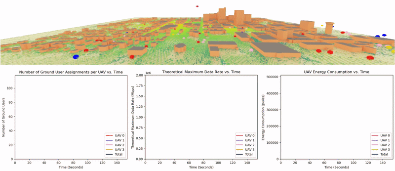

# RL-AERPAW-DT

Reinforcement Learning Pipeline over AERPAW UAV Digital Twin.

## Goals
- Construct a pipeline for the simulation of pedestrian data using SUMO
- Import building data from OpenStreetMaps and use Sionna for ray tracing
- Create a realistic simulation for simulating UAV communication with ground users in urban settings.
- Train a reinforcement learning model to control the UAVs to maximize the communication capacity of the UAV network with the Ground Users.

## Current Task
- Working on a minimial control framework to simulation UAV and pedestrian movement and provide a wrapper for machine learning algorithms.

## What's Done Already
- Generating pedestrian data with SUMO and parsing it into a usable format.
- Importing data from OpenStreetMaps into Sionna
- Running Sionna ray tracing algorithms to determine communication metrics like path loss between a UAV and a ground user.

